# Agentic AI
This repository contains all documentation and artifacts to setup the new genAI Hands on Workshop.

The exercise guide (Labs) can be found in this readme markdown file.


## Project Structure

The project is organized with the following folder structure:

```
.
├── code/              # Backend scripts, and notebooks needed to create project artifacts
├── data/              # data that needs to be loaded into the warehouse
├── images/            # A collection of images referenced in project docs
├── tools /            # python tools that need be loaded into the tool template
```

By following the exercises, you will understand how with cloudera AI you can author and deploy your own agentic workflows:

- Create Workflow
- by creating Agents
- adding tools for accessing data
- deploy your workflow
- revisit the workflow and replace part of the tools with an mcp server


## Lab 1: Log in and Settings configuration

#### Login into the CDP tenant

Welcome to the virtual hands on Lab of October 9th. 2025. You all have been assigned a unique user name.

Search for your first name and the initial of your last name and memorize the assigned user name.

<br/>

<br/>
<br/>

When you enter the url in your browser, that was shared in the chat, you get following login page, where you now enter
your given user name and password

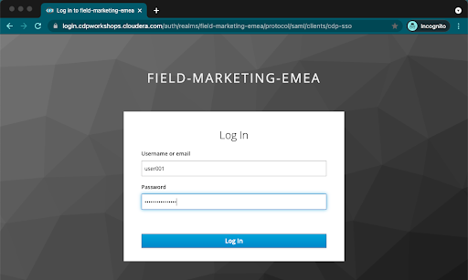

In case of success you should get to this home page of the CDP tenant:
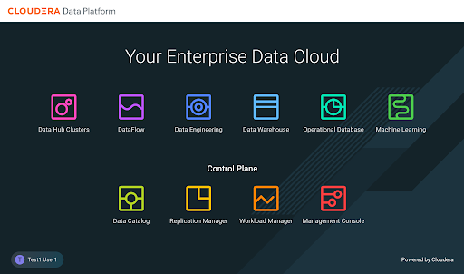

- Go to the Workshop CDP Tenant
- Navigate to the CLoudera AI tile from the CDP Menu.
- Click into the Workbench by clicking the Workbench name.
- 
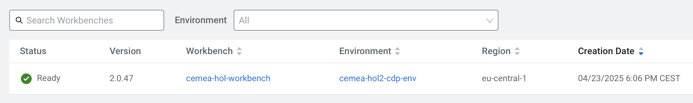

A Workspace is a cluster that runs on a kubernetes service to provide teams of data scientists a platform to develop, test, train, and ultimately deploy machine learning models. It is designed to deploy a small number of infra resources and then autoscale compute resources as needed when end users implement more workloads and use cases.

- Click on *User Settings* in the left panel
- Go to Environment Variables tab and set your WORKLOAD_PASSWORD (this is the same as your login password for your User0xx ).

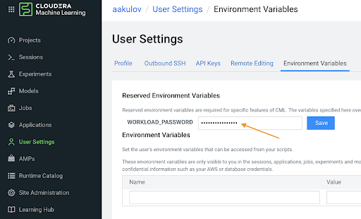

- Go to “Projects” on the left side panel > Select “Public Projects” from the dropdown.
- Click on the publicly available project named **AgenticAI**.

<br/>
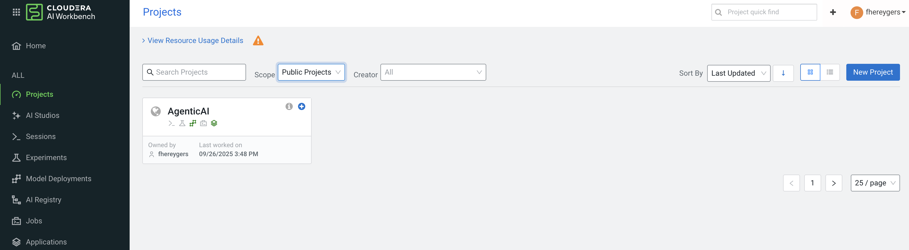
 <br/>

- Click on AI Studios > Agent Studio in the left menu
- then click **get started** to get to the home screen of Agent Studio

<br/>
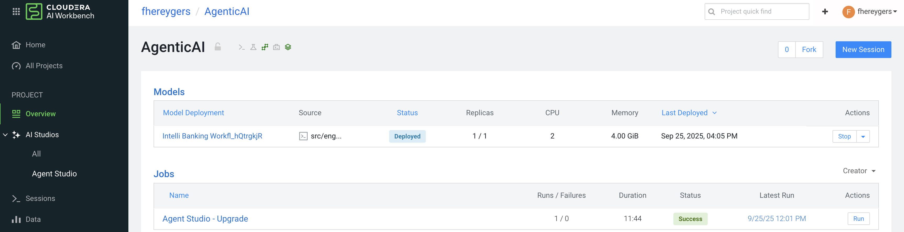
 <br/>


## Lab 2: Start creating workflow with agents

Take a moment to get familiar with the Agent Studio application.

In the top right corner you see four tabs: Agentic Workflow, Tools Catalog , LLMs and Feedback.

By default you are in the Agentic Workflow tab, and below you find an overview of deployed workflows (if any), Draft workflows (if any) and workflow templates.

Workflow templates allow you to create a new workflow based upon a template. This is a sort of quick start or samples to give ideas on how to typically build workflows.

<br/>
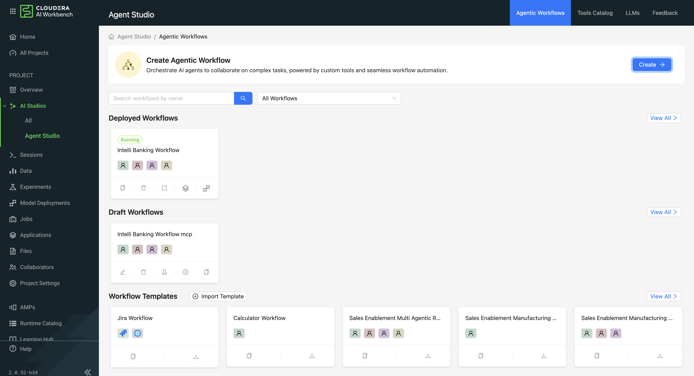
 <br/>

However we are going to build a complete workflow from scratch (sorry about this :-))

To do so, in the Agentic workflow tab:
- click on the button **Create**
- You are then asked to give a workflow name, so enter: **" 'your user name' Intelli Banking"** and then click **Create Workflow** at the right bottom of the screen
- Set Conversational: ON
- Set Manager Agent: ON

<br/>
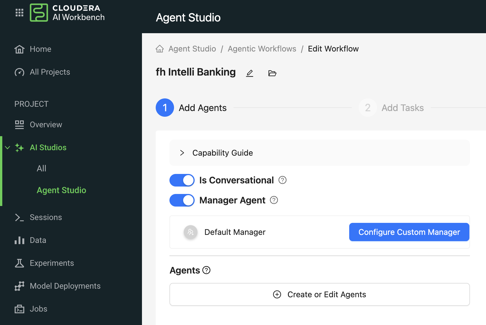
 
 <br/>


 - Click on the  **Create or Edits Agents** button, in order to create following 4 Agents, by filling out the fields accordingly for each single agent and by clicking **create Agent** at the lower right of the screen (use the openai option for LLM): 


| Name | Customer Analyst |
| ----------- | ----------- |
| Role | Customer Segmentation and Profiling Specialist |
| Backstory | Skilled in profiling and segmentation using customer data for personalized banking strategies. |
| Goal | Identify customer personas based on income, balances, loans, and demographic data from customer_profiles table. |


| Name | Transactions Analyst |
| ----------- | ----------- |
| Role | Behavioral and Spend Pattern Analyst |
| Backstory | Specializes in behavioral analytics to support targeting for marketing and engagement. |
| Goal | Detect customer behavioral patterns using transaction_data to surface high-potential leads or risk indicators. |

| Name | Product Recommender |
| ----------- | ----------- |
| Role | Personalized Product Recommendation Engine |
| Backstory | Product expert helping align offerings with usage trends and customer potential. |
| Goal | Match bank products (credit cards, loans) to customer profiles and behaviors using product_offers. |

| Name | Competitive Insights |
| ----------- | ----------- |
| Role | External Market Intelligence Agent |
| Backstory | Competitive intelligence agent scraping the latest banking promotions. |
| Goal | Scrape live web content to identify loans, credit offers offers, compare with internal product catalog, and propose competitive positioning. |


When you finished entering the above fields and saved the created agents, your screen should look like this:

 <br/>
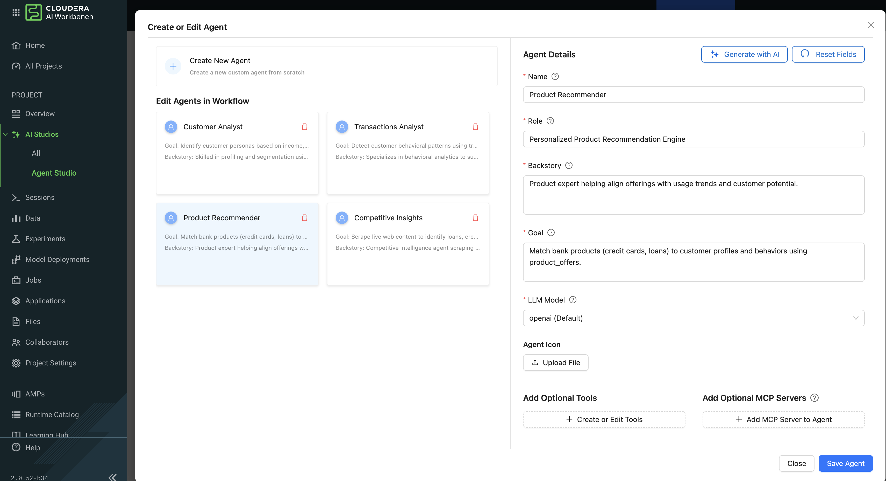
 
 <br/>

Take a moment to select each agent tile on the left hand side, and review the agent settings on the right hand. So we define an agents behaviour by means of natural language that are leveraged as prompts when calling the LLM.

- When you finished reviewing click **close** at the bottom right, to get to the workflow page page again.

At the top of the screen you see that we are in the **Add Agents** step and you see also the next steps. 
On the right you see a graph that links the agents with a default manager.

In the next lab we are going to add tools to the 4 agents, so they can do actions.

 <br/>
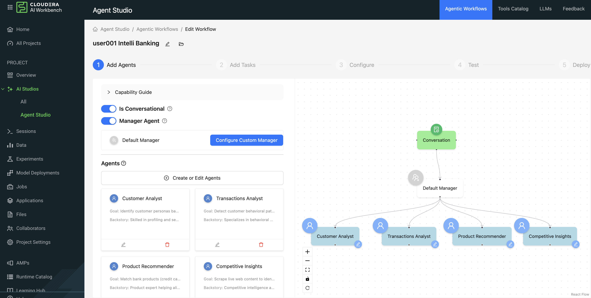
 
 <br/>


## Lab 3: Add Tools to all four agents

- Click on the **Create or Edit Agents** button again.
- For each of the agents, created in lab 2, select each agent one by one and add the relevant tool by clicking the **Create or Edit Tools** button

For the Agents **Customer Analyst, Transactions Analyst and Product Recommender**:

- select the tool **hol db tool** out of the tool template 
- click **Create tool from Template**.
- click **Save tool** and then **close**

For the Agent **Competitive Insights**:

- select the tool **hol web scraper** out of the tool template 
- click **Create tool from Template**.
- click **Save tool** and then **close**


**Tip: you can limit the selection of tool templates by entering **hol** in the search template mask**

 <br/>
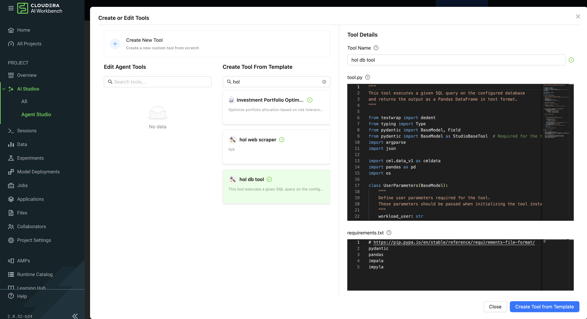
 
 <br/>

When finished, you can once again click through the agents again and verify all agents got the right tool assigned.

<br/>
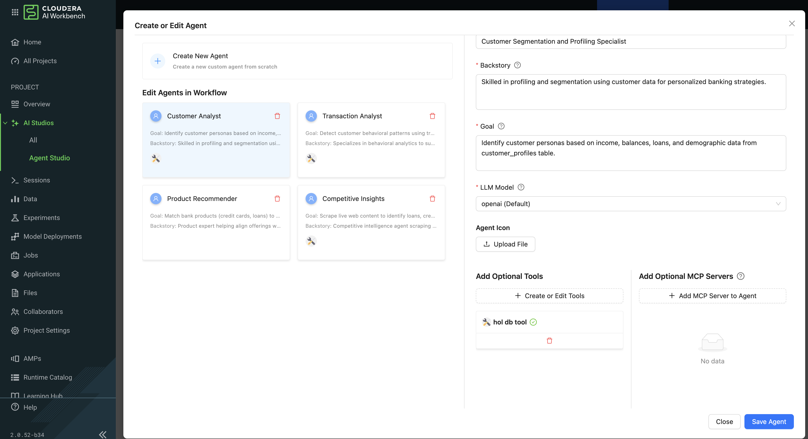
 
 <br/>

- Click **close** to get to the "Edit Workflow" page.

Now the graph on the right hand side should contain also the right tools for each agent. 

 

We are finished with the **Add Agents** step. 

<br/>
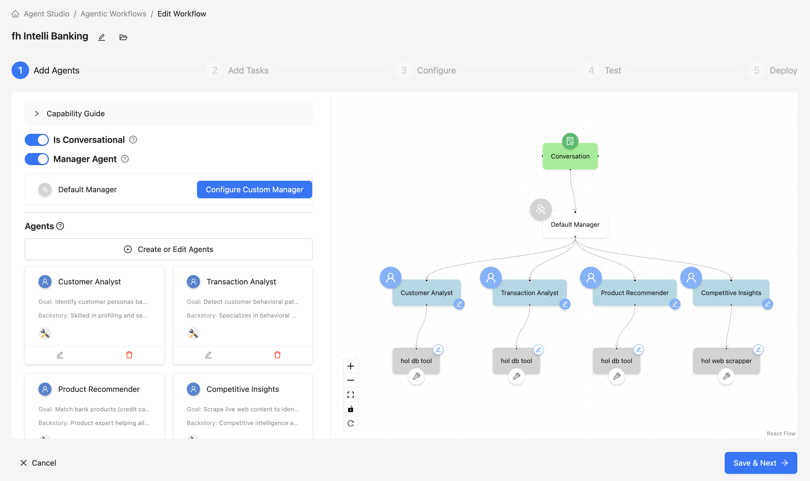
<br/>

## Lab 4 configure Workflow and test draft workflow

- Click on the **Save & Next** button to get in the next step "Add tasks". As it is a converstional workflow no additional setting is required.
- Click again on the **Save & Next** button to get to the "configure" step.
- Enter your the required parameters for all tools, the below image should give you hints on the values. Otherwise check the chat for information.
- Click the **Save & Next** button to get to the "Test" step.
  

 <br/>
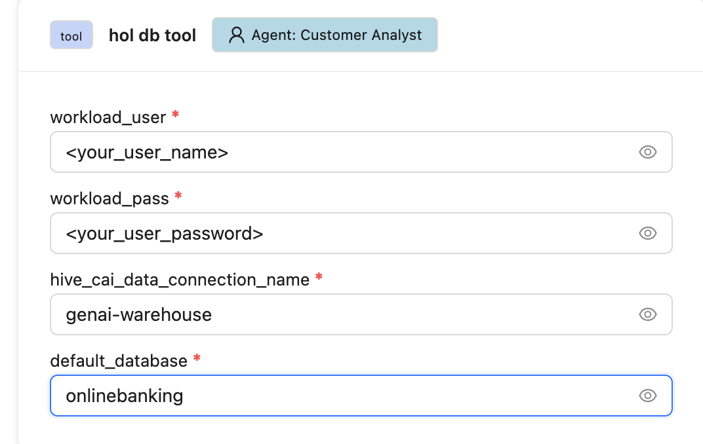
 <br/>

 Test the workflow with following test questions:
 - How many customers do we have in Dubai?
 - Who are the top spenders in the last 30 days?
 - Who are the top 3 credit card customers based on their total spending?


## Lab 5  Deploy Workflow 

Now Deploy your worklflow BUT also save your work as workflow template!

Wait for the deployed workflow to be up and running.
You can find your deployed workflow by:
- Going to the Home Page of Agent Studios.
- Select your Workflow from Deployed Workflows.
- Click on Open Application UI.

and then ask following questions:
- which are the top 3 spending categories?
- What are the credit card offers from barclays bank www.barclays.co.uk ?
- Compare our credit card offers with barclays bank www.barclays.co.uk ?
- Which customers are eligible for these offers and share their details?


## Lab 6 leverage MCP server instead of hol db tool
 
- Create a new workflow, the template you saved in lab 5.
- Replace for the relevant 3 agents the **hol db tool** with the mcp server that is available in your environment.
- Test the workflow, by entering the previous questions.


----------------------------------------- THE END ----------------------


## Lab 5: Interacting with the visual application (10 min)


You have already seen that Cloudera Data Visualization is deployed in Cloudera AI as an Application. In fact, any custom, UI app can be hosted within Cloudera AI. These can be streamlit, Django, or Rshiny (or other frameworks) apps that deliver custom visualization or incorporate a real-time model scoring.

In the following steps we will deploy an Application for the Churn Customer project:

- Go to *Models* and click on the model that you’ve deployed
- Go to the *Settings* tab and copy the *Access Key* string

<br/>

<br/>

- Navigate to *Files > flask > single_view.html*
- Click on *Open in Session* to get the file in edit mode (No Need to start the actual session)
- **Important!** On line 61 of the file, update the access key value with the Access Key you got earlier.
- Click *File > Save (or ⌘+S)*
- Click on *Apllications*  in the side panel
- Click on *New Application*
- Give your application a name, and provide a **unique** subdomain
- Under *Scripts* select *code/6_application.py*
- Ensure that a *Workbench* editor is selected
- and *Enable Spark* toggle is turned on

<br/>

<br/>

- Scroll the bottom of the page and click *Create Application*  

Application startup can take up to 2 minutes, and once the application is ready you’ll see a card similar to this:

<br/>

<br/>


Click on the application in order to open it. This will automatically redirect you to the Visual Application landing page where the same data you worked with earlier is presented in an interactive table.

On the left side notice the probability column. This is the target variable predicted by the Machine Learning Model. It reflects the probability of each customer churning. The value is between 0 and 1. A value of 0.49 represents a 49% probability of the customer churning. By default, if the probability is higher than 50% the classifier will label the customer as “will churn” and otherwise as “will not churn”.

The 50% threshold can be increased or decreased implying customers previously assigned a “will churn” label may flip to “will not churn” and vice versa. This has important implications as it provides an avenue for tuning the level selectivity based on business considerations but a detailed explanation is beyond the scope of this content.

- Next, click on the customer at the top of the table to investigate further.


A more detailed view of the customer is automatically loaded. The customer has a 58% chance of churning.

The Lime model applied to the classifier provides a color coding scheme highlighting the most impactful features in the prediction label being applied to this specific customer.

For example, this customer’s prediction of “will churn” is more significantly influenced by the “Internet Service” feature.
- The dark red color coding signals that the customer is negatively impacted by the current value for the feature.
- The current values of Monthly Charges and Phone Service also increase the likelihood of churn while the values of the Streaming Movies and Total Charges features decrease the likelihood of churn.


Let’s see what happens if we change the value for the most impactful feature in this given scenario i.e. “Internet Service”. Currently the value is set to “Fiber Optic”.

- Hover over the entry in the table and select “DSL”.


The table has now reloaded and the churn probability for this customer has dramatically decreased to roughly 15%.

This simple analysis can help the marketer optimise strategy in accordance to different business objectives. For example, the company could now tailor a proactive marketing offer based on this precious information. In addition, a more thorough financial analysis could be tied to the above simulation perhaps after adjusting the 50% threshold to increase or decrease selectivity based on business constraints or customer lifetime value assigned to each customer.  


#### Script 6: Exploring the Application Script

- Navigate back to the Cloudera AI Project Home folder.
- Open the “Code” folder and then script “6_application.py”.

This is a basic Flask application that serves the HTML and some specific data used for.

- Click on “Open in Workbench” to visualize the code in a more reader friendly-mode.


Now you will be able to explore the code with the Workbench Editor. The “Launch Session” form will automatically load on the right side of your screen. There is no need to launch a session so you can just minimize it.

As always no code changes are required. Here are some key highlights:

- At lines 177 - 191 we load the model and use the “Explain” method to load a small dataset in the file. This is similar to what you did in script 5. If you want to display more data or fast changing data there are other ways to do this, for example with Cloudera SQL Stream Builder.  
- At line 248 we run the app on the "CDSW_APP_PORT". This value is already preset for you as this is a default environment variable. You can reuse this port for other applications.


## Optional Lab 6: Cloudera AI Model Operations (15 min)

The following steps assume you have executed the* 7a_ml_ops_simulation.py* script as shown in Lab 4. If you haven’t done it please go back and make sure to run the model simulation script.

- Navigate back to the project overview and launch a new session with the following configurations.

  - **Session Name: telco_churn_ops_session**
  - **Editor: Workbench**
  - **Kernel: Python 3.9**
  - **Resource Profile: 1vCPU/2 GiB Memory**
  - **Runtime Edition: Standard**
  - **Runtime Version: Any available version**
  - **Enable Spark Add On: any Spark version**

- Once the session is running, open script *7b_ml_ops_visual.py* and explore the code in the editor.
- Execute the whole script end to end without modifications.

Observe the code outputs on the right side. Here are the key highlights:

- Model predictions are tracked in the Cloudera AI Models Metrics Store. This is enabled by the use of the Python decorator and the use of “cdsw.track_metrics” methods in script 5. What is being tracked is completely up to the script developer.
- You can then extract the predictions and related metadata and put the information in a Pandas dataframe. Again, the Python library you use does not matter and is entirely up to the developer.
- This is exactly what the first diagram on the right side of your screen shows. Each column represents a prediction request reaching your Cloudera AI Model endpoint. Each row represents a metric you are tracking in the Cloudera AI Models Metrics Store.


- Once the tracked metrics have been saved to a Python data structure they can be used for all sorts of purposes.
- For example, the second diagram shows a basic line plot in Seaborn where the models’ output probabilities are plotted as a function of time. On the X axis you can see the timestamp associated with each request. On the Y axis you can find the associated output probability.


- Similarly, you can plot processing time as shown in the third diagram. This represents the time duration required to process a particular request.
As an example, this information could be used to trigger the deployment of more resources to support this model endpoint when a particular threshold is passed. -  You can deploy more resources manually via the UI, or programmatically and in an automated CI/CD pipeline with Cloudera AI APIv2 and Cloudera AI Jobs.


- You can also monitor the model’s accuracy over time. For example, the below diagram shows a line plot of prediction accuracy sorted over time. As you can see, the trend is negative and the model is making increasingly less accurate predictions.
- Just like with processing time and other metrics, Cloudera AI allows you to implement ML Ops pipelines that automate actions related to model management. For example, you could use a combination of Cloudera AI Jobs and Cloudera AI APIv2 to trigger the retraining and redeployment of a model when its accuracy reaches a particular threshold over a particular time period.
- As always this is a relatively basic example. Cloudera AI is an open platform for hands-on developers which gives users the freedom to implement more complex ML Ops pipelines.


- Ground truth metrics can be collected with the cdsw.track_delayed_metrics method. This allows you to compare your predictions with the actual event after the prediction was output. In turn, this allows you to calculate the model accuracy and create visualizations such as the one above.
- For an example of the cdsw.track_delayed_metrics method open the “7a_ml_ops_simulation.py” script and review lines 249 - 269. Keep in mind that this is just a simulation.
- In a real world scenario the requests would be coming from an external system or be logged in a SQL or NoSQL database. In turn, the script above would be used to set  ground truth values in batch via a Cloudera AI Job or in real time with a Cloudera AI Model endpoint.


## Optional Lab 7: Model Lineage Tracking (20 min)

CDP is an end-to-end hybrid enterprise data platform. Every user, workload, and dataset and  machine learning model can be governed from a central location via SDX, the Shared Data Experience.

Under the hood, SDX tracks and secures activity related to each CDP Data Service via “Hooks” and “Plugins”, including Cloudera AI. If you want your models to be logged in SDX you have to add them to the lineage.yml file located in your project home folder.

- Click on *Overview*  and find *lineage.yml* file
- Click on the file to open


Take note of the metadata that is present here, including the source table name and the query used to create the training dataset. Additional metadata can be provided here.


This gathered metadata can either be accessed in the Data Catalog (Tile is in the main menu) or Atlas.


In order to access by means of Atlas you can use following steps:

- Click on the top left corner menu (Bento menu)


- Click on *Management Console*
- Click on the CDP environment you have been working in (where ML Workspace is deployed)
- Click on *Atlas* under QUICK LINKS


From the Atlas UI, search for ML models by entering the *ml_model_build* type. Notice that there are various Atlas entities to browse for models.


In the output, you will see all models that your colleagues deployed in this workshop. Notice that each model is assigned a unique ID at the end. That ID corresponds to the Model Build from Cloudera AI. Identify your model using the Build Id noted down when you deployed your model. select the model you created.
Open your model by clicking its Model Name - Build Id.


Familiarize yourself with the Model properties tab. Notice that each model logged is associated with rich metadata. You can customize Atlas Model metadata by editing the lineage.yml file in the Cloudera AI Project Home folder


Atlas and Ranger provides a rich set of Governance and Security capabilities. For example, you can apply Atlas tags to your entities across Data Services and then propagate Ranger policies to automatically secure applications across complex pipelines.

A detailed exploration of SDX in the context of Cloudera AI is not in scope for this workshop but please visit the “Next Steps” section to find out more on this and other topics.


## Summary

In this workshop you created an end to end project to support a Machine Learning model in Production.

- You easily created a Spark Session and explored a large dataset with the PySpark library.
- ... were able to switch between editors, resources, and optionally Python and Spark versions at the click of a button.
- created a Model REST Endpoint to serve predictions to internal or external business applications.
- Then, you built an interactive dashboard to make the “black box model” interpretable for your business stakeholders.
- You explored the foundations of a basic ML Ops pipeline to easily retrain, monitor, and reproduce your model in production. With the Cloudera AI Models interface you unit tested and increased model observability.
- Finally, you used CDP SDX to log and visualize Model Metadata and Lineage.

